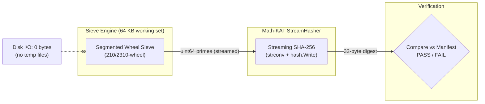
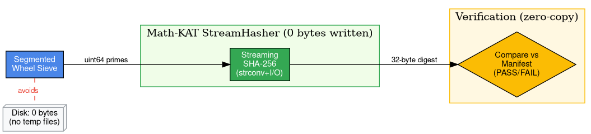

# gofastsieve — Segmented Sieve with Math-KAT Bridge

[](https://github.com/gilflorida2023/math-kat)

Go port of [fastsieve](https://github.com/gilflorida2023/fastsieve) — a segmented prime sieve with integrated
[Math-KAT](https://github.com/gilflorida2023/math-kat) streaming SHA-256 verification. Outperforms the C reference
on the same hardware while using 3–4× less memory.

## Math-KAT Integration

Math-KAT (Mathematical Known Answer Test) is a streaming cryptographic verification framework for OEIS integer
sequences. Borrowing the **KAT** concept from cryptographic certification, it validates sequence generators by
streaming terms through SHA-256 and comparing the 32-byte digest against a published manifest — with **zero bytes
written to disk** and only **64 KB of working memory**.





### The Algorithmic Sandbox

This development model eliminates the traditional "generate → write → hash → verify → delete" cycle:

```
Traditional:  generate → write 100MB file → hash file → verify → delete → repeat
                                                                                   3–5 min/iteration
Math-KAT:     generate → stream SHA-256 → compare → done
                                                                                   5–50 ms/iteration
```

For large prime tiers (10^12 primes), the traditional approach writes ~14 TB per verification run. Math-KAT
reduces this to **0 bytes**, making the inner loop of algorithm development effectively instantaneous.

### Verification Tiers

| Tier | Terms | Time | Purpose |
|------|-------|------|---------|
| `min` | 100 | <1 ms | Smoke test |
| `ci_smoke` | 1,000 | ~1 ms | CI on every push |
| `dev` | 100,000 | ~80 ms | Developer iteration |
| `extended` | 1,000,000 | ~5 min | Weekly regression |
| `hpc` | 10^12+ | Hours | Final validation |

The hashes produced by `--hash` match the [Math-KAT manifest](https://github.com/gilflorida2023/math-kat)
for sequence [A000040 (primes)](https://oeis.org/A000040) and are independently reproducible across
implementations.

## Quick Start

```bash
# Build
go build -o fastsieve ./cmd/fastsieve

# Generate first 1000 primes with Math-KAT hash
./fastsieve --count=1000 --hash
# 18ac898998c81cb9eb52d37be6cd452a3b19babedbdd5cc6e8ffff20e7c2b048

# Verify against expected hash
./fastsieve --count=1000 --verify=18ac898998c81cb9eb52d37be6cd452a3b19babedbdd5cc6e8ffff20e7c2b048
# OK: hash matches 18ac8989...

# Sieve to a limit with live progress
./fastsieve --progress --limit=100000000
```

## CLI Reference

```
Usage: fastsieve [flags]

Mode selection (one required):
  --count uint   Generate first COUNT primes (e.g. --count=1000)
  --limit uint   Generate primes up to LIMIT (e.g. --limit=1000000)

Wheel configuration:
  --wheel uint   Wheel modulus: 2, 6, 30, 210 (default), or 2310

Math-KAT hash:
  --hash              Output SHA-256 hex hash of all primes generated
  --verify string     Verify hash against EXPECTED hex string (exit code 2 on mismatch)

Output:
  -o string           Write primes to FILE (use "-" for stdout)
  --hash-output FILE  Write primes to FILE and hash digest to FILE.sha256
  --verify-hash FILE  Verify FILE against FILE.sha256 (standalone, no sieve)
  -c                  Count-only mode (no hash, no I/O — fastest)

State persistence:
  -s            Save state to file for later resume
  -R            Resume from saved state file (replays primes through hash)
  -r            Report state from file (no sieve)
  --state FILE  State file path (default: primes_state.bin)

Miscellaneous:
  --progress    Show live progress with rate and ETA
```

### Important Notes

- `--hash` output uses the [Math-KAT `ascii_integer_lf`](https://github.com/gilflorida2023/math-kat)
  format: each prime written as ASCII decimal digits followed by `\n`, no leading zeros, no trailing spaces.
- Without any output flag (`--hash`, `-o`, `-c`, etc.), the default is `--hash`.
- `-c` suppresses all output and hashing — useful for benchmarking the raw sieve.
- `-R` catches up the hash incrementally from the state file, then continues sieving from where it left off.

### Bit-Packed Variant: `bitsgofastsieve`

```bash
# Build
go build -o bitsgofastsieve ./cmd/bitsgofastsieve
```

`bitsgofastsieve` is an optimized variant that packs spoke survivors into `uint64` bitmasks and uses
`bits.TrailingZeros64` to scan only set bits in Phase 2. This benefits large wheels the most.

**Wheel support:** 30, 210, 2310 wheel only (use `fastsieve` for wheel 2/6).

**Performance (10M limit, count-only, Go):**

| Wheel | `fastsieve` (byte) | `bitsgofastsieve` (bit) | Δ |
|-------|-------------------|------------------------|---|
| 30 | 39.0ms | 31.4ms | **+20%** |
| 210 | 34.8ms | 26.4ms | **+24%** |
| 2310 | 41.4ms | 28.6ms | **+31%** |

Bit-packed wheel-2310 (28.6ms) is the fastest configuration, surpassing byte-based wheel-210 (34.8ms)
by 18%.

All hashes and output are identical between the two binaries — only the inner loop changes.

## Examples

### File output with hash sidecar
```bash
./fastsieve --hash-output=primes.txt --limit=16000000
# primes.txt          → all primes ≤ 16,000,000
# primes.txt.sha256  → "sha256hex  primes.txt"
```

### Verify a primes file against its sidecar
```bash
./fastsieve --verify-hash=primes.txt
# OK: hash matches ...
```

### State persistence (simulating an interrupted job)
```bash
# First run: save state after sieving
./fastsieve -s --limit=50000

# Report progress (50% if interrupted at 25000)
./fastsieve -r
# State file: primes_state.bin
# Wheel modulus: 210
# Target: 50000
# Last sieved: 25000
# Primes found: 2744
# Progress: 50.00%

# Resume: catches up hash incrementally, finishes sieving
./fastsieve -R --hash
# Hash matches fresh run at limit=50000
```

### Count-only benchmark
```bash
time ./fastsieve -c --limit=1000000000
```

## Math-KAT Cross-Verification

Hashes can be independently verified via the Math-KAT Python CLI:

```bash
pip install math-kat

# Hash first 1000 primes
./fastsieve --count=1000 --hash
# 18ac898998c81cb9eb52d37be6cd452a3b19babedbdd5cc6e8ffff20e7c2b048

# Verify against manifest
python3 -m math_kat verify \
    --sequence A000040 \
    --manifest manifests/A000040.json \
    --tier ci_smoke \
    --stdin < <(./fastsieve --count=1000 -o -)
```

### Checkpoint Hashes

The following hashes are deterministic and platform-independent:

| Count | Hash |
|-------|------|
| 10 | `dc8c353498db9b9bb1161eab32f94206df30e014947ae64482851f3fafed07ff` |
| 100 | `5991e67de21b5e0aac4191be06e69b5e32e8431858a108c4029906aaa96a1371` |
| 1,000 | `18ac898998c81cb9eb52d37be6cd452a3b19babedbdd5cc6e8ffff20e7c2b048` |
| 10,000 | `de1b90e91ee8193f153cd9d6f79887a1ba05e2365a8ee230c6c6eb23c1ab5fe4` |
| 100,000 | `19778d8659445c92f6f2b1f5deed0932fbd2ab31fe07cc714ef64847eb1a8236` |

These serve as regression checkpoints for any implementation targeting the Math-KAT spec.

## Testing

```bash
# Unit tests
go test -v ./...

# Race detection
go test -race ./...

# All tests pass
go test ./...
ok  github.com/gilflorida2023/gofastsieve/internal/sieve  0.003s
```

### Micro-benchmarks

| Benchmark | Iterations | Time/op | Memory | Allocs |
|-----------|-----------|---------|--------|--------|
| Sieve 100K primes | 298 | 3.98 ms | 291 KB | 31 |
| Hash first 100 primes | 207,132 | 5.42 µs | 4 KB | 27 |
| Hash first 1,000 primes | 26,942 | 44.2 µs | 8 KB | 30 |
| Hash first 10,000 primes | 1,917 | 602 µs | 45 KB | 34 |

## Performance

All benchmarks measured on an **AMD Ryzen 7 PRO 5850U** (Zen 3, 8 cores, 1.9–4.4 GHz) with
`go build -ldflags="-s -w"` and `gcc -O3 -march=native`.

### Pure Sieve (Count-Only)

| Limit | Primes | Go (this) | C (reference) | Go vs C | Go Memory | C Memory |
|-------|--------|-----------|---------------|---------|-----------|----------|
| 10^6 | 78,498 | 0.00s | 0.01s | **~2×** | 2.3 MB | 9.8 MB |
| 10^7 | 664,579 | 0.03s | 0.05s | **1.7×** | 2.4 MB | 9.9 MB |
| 10^8 | 5,761,455 | 0.36s | 0.44s | **1.2×** | 2.5 MB | 10.0 MB |
| 10^9 | 50,847,534 | 3.94s | 4.67s | **1.2×** | **2.7 MB** | 10.0 MB |

### Streaming SHA-256 Overhead (Go)

| Limit | Count-Only | With Hash | Overhead |
|-------|-----------|-----------|----------|
| 10^6 | 0.00s | 0.00s | minimal |
| 10^7 | 0.03s | 0.05s | +67% |
| 10^8 | 0.36s | 0.51s | +42% |
| 10^9 | 3.94s | 5.47s | +39% |

The hash overhead shrinks as ranges grow — SHA-256's block rate keeps pace with the sieve's
increasing segment dispatch costs.

### Wheel Modulus Comparison (Go, 10^9)

| Wheel | Residues | Skipped | Time |
|-------|----------|---------|------|
| 30 | φ(30)=8 | 73.3% | 4.04s |
| 210 | φ(210)=48 | 77.1% | **3.66s** |
| 2310 | φ(2310)=480 | 79.2% | 4.53s |

Wheel-210 is the optimal balance of skip efficiency vs per-segment overhead on this hardware.

## Architecture

The implementation is split across two packages:

**`internal/sieve/`** — Core library:
- `sieve.go`: `Eratosthenes` struct with `ForEachPrime` callback API
- `segmented.go`: Segment generation using wheel-residue patterns
- `wheel.go`: Wheel configuration tables and spoke mapping
- `mathkat.go`: `StreamHasher` — streaming SHA-256 in `ascii_integer_lf` format
- `state.go`: `StateWriter`, `StateHeader` — 48-byte binary checkpoint format

**`cmd/fastsieve/`** — CLI (byte-based, all wheels):
- `main.go`: Flag parsing, sieve orchestration, file I/O, resume logic

**`cmd/bitsgofastsieve/`** — CLI (bit-packed, wheels 30/210/2310):
- `main.go`: Same interface, uses `BitPackedEratosthenes` for up to 31% faster Phase 2 scanning

### State File Format

| Offset | Size | Field |
|--------|------|-------|
| 0 | 4 | Magic: `0x46535350` ("FSSP") |
| 4 | 4 | Version: 1 |
| 8 | 8 | Wheel modulus |
| 16 | 8 | Target (sieve bound) |
| 24 | 8 | Last sieved prime |
| 32 | 8 | Total primes found |
| 40 | 8 | Reserved |
| 48 | — | Text primes (one per line) |

The binary header is overwritten atomically via `WriteAt` during checkpoints.

## Related

- [math-kat](https://github.com/gilflorida2023/math-kat) — Known Answer Tests for OEIS integer sequences
- [fastsieve](https://github.com/gilflorida2023/fastsieve) — C reference implementation with bucket sieve

## License

MIT
